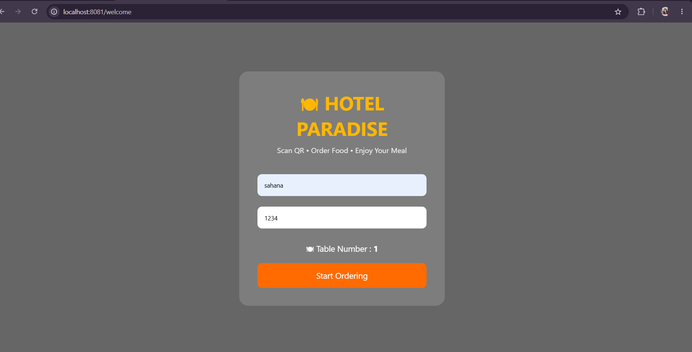
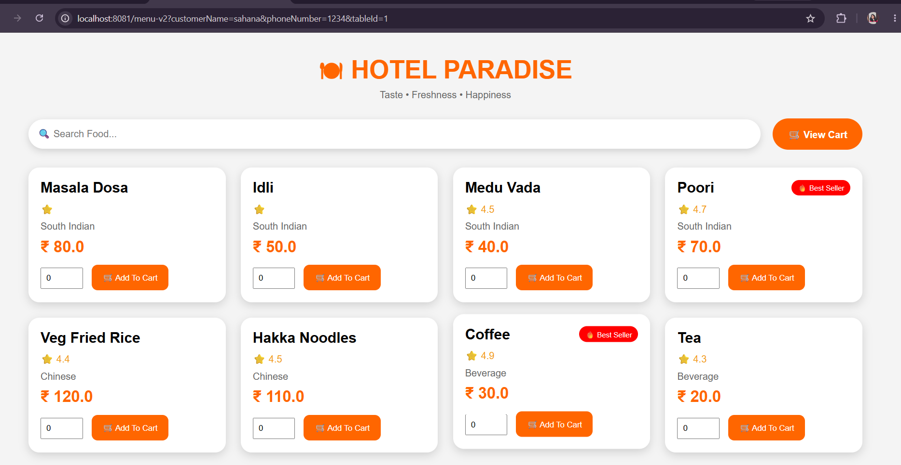
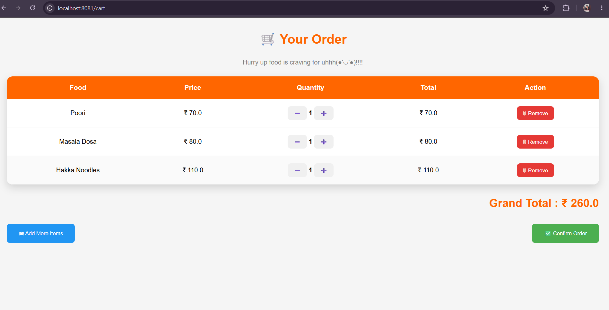
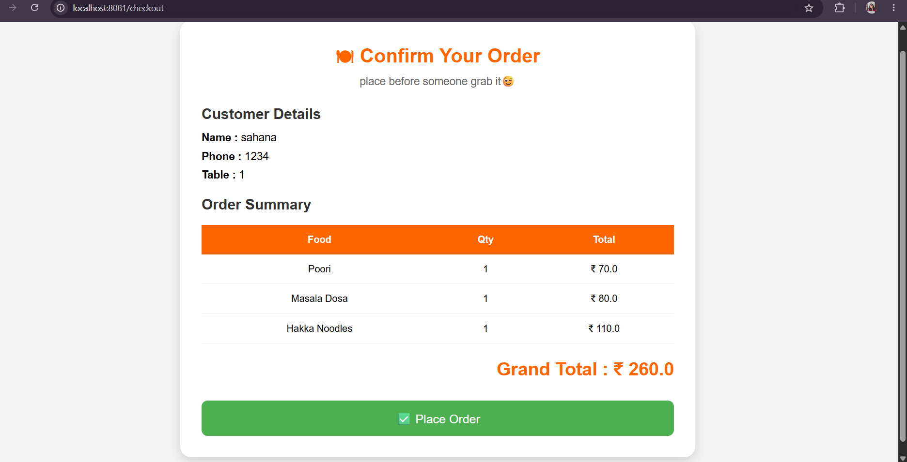
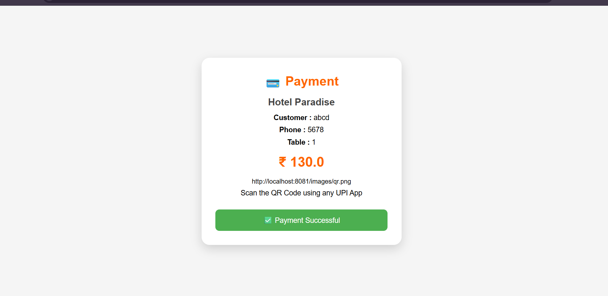
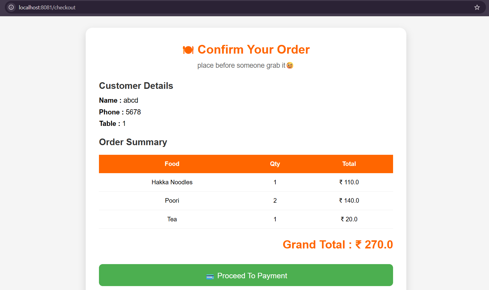
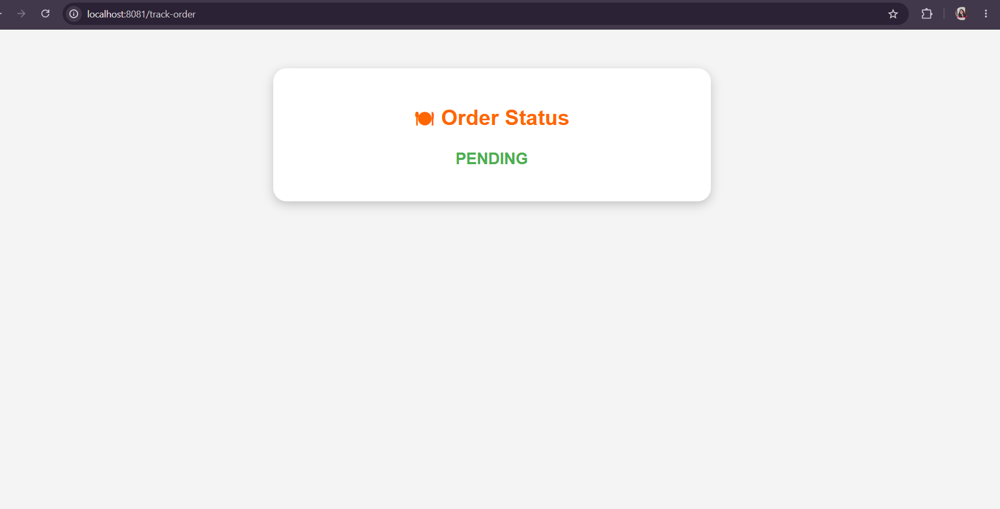
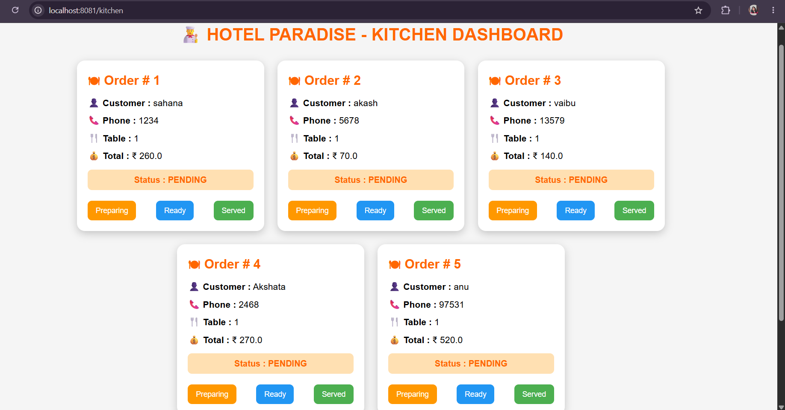
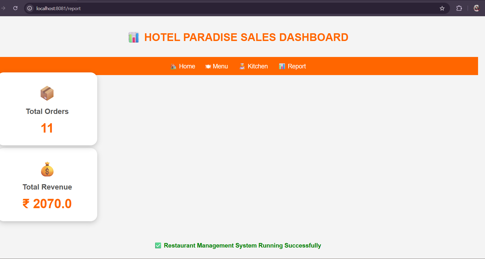
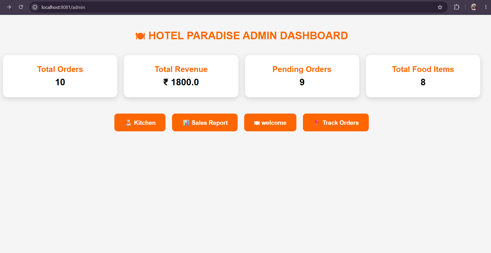

# 🍽 Smart Restaurant Ordering System

A **QR-Based Restaurant Ordering System** developed using **Spring Boot, Thymeleaf, MySQL, HTML, CSS, and Java**.

This application allows customers to scan a QR code, browse the menu, place food orders, make payments, track their order status, and enables restaurant staff to manage orders through an admin dashboard and kitchen dashboard.

---

# 🚀 Features

## 👤 Customer Module

- Welcome Page
- QR-Based Restaurant Access
- Browse Food Menu
- Add Items to Cart
- Update Cart Quantity
- Checkout Page
- Payment Page
- Order Confirmation
- Track Order Status

---

## 👨‍🍳 Kitchen Module

- View Incoming Orders
- View Customer Details
- Update Order Status
  - Pending
  - Preparing
  - Served

---

## 👨‍💼 Admin Module

- Admin Dashboard
- Kitchen Dashboard
- Sales Report
- Total Orders
- Total Revenue
- Pending Orders
- Food Menu Overview

---

# 🛠 Technologies Used

- Java 21
- Spring Boot
- Spring MVC
- Thymeleaf
- MySQL
- HTML5
- CSS3
- Maven
- Git
- GitHub

---

# 📂 Project Structure

```text
restaurant-ordering-system
│
├── screenshots
│
├── src
│   ├── main
│   │   ├── java
│   │   │   ├── Controller
│   │   │   ├── Service
│   │   │   ├── Repository
│   │   │   ├── Entity
│   │   │   └── RestaurantOrderingSystemApplication.java
│   │   │
│   │   ├── resources
│   │   │   ├── templates
│   │   │   ├── static
│   │   │   └── application.properties
│
├── pom.xml
│
└── README.md
```

---

# 📸 Application Screenshots

## 🏠 Welcome Page



---

## 🍽 Menu



---

## 🛒 Cart



---

## ✅ Checkout



---

## 💳 Payment



---

## 🎉 Order Confirmation



---

## 📍 Track Order



---

## 👨‍🍳 Kitchen Dashboard



---
## 📊 Sales Report


---

## 👨‍💼 Admin Dashboard



---

# ▶️ How to Run

### 1️⃣ Clone the Repository

```bash
git clone https://github.com/saha2098/Smart-Restaurant-Ordering-System1.git
```

---

### 2️⃣ Open the Project

Open the project using **IntelliJ IDEA**.

---

### 3️⃣ Configure MySQL

Create a MySQL database.

Example:

```sql
CREATE DATABASE restaurant_db;
```

---

### 4️⃣ Update Database Credentials

Edit the `application.properties` file.

```properties
spring.datasource.url=jdbc:mysql://localhost:3306/restaurant_db
spring.datasource.username=root
spring.datasource.password=YOUR_PASSWORD
```

---

### 5️⃣ Run the Application

Run:

```
RestaurantOrderingSystemApplication.java
```

---

### 6️⃣ Open the Browser

```
http://localhost:8081/welcome
```

---

# 📌 Future Enhancements

- Online Payment Gateway Integration
- Admin Login Authentication
- Customer Login & Registration
- Table Reservation System
- Food Reviews & Ratings
- Email/SMS Order Notifications
- AI-Based Food Recommendations
- Mobile Application

---

# 🎯 Project Highlights

✔ QR-Based Restaurant Ordering

✔ Shopping Cart

✔ Payment Page

✔ Order Tracking

✔ Kitchen Dashboard

✔ Admin Dashboard

✔ Sales Report

✔ Responsive UI

✔ Spring Boot MVC Architecture

✔ MySQL Database Integration

---

# 👩‍💻 Developed By

**Sahana R**

Computer Science Engineering Student

---

# ⭐ If you like this project, don't forget to Star the repository!
